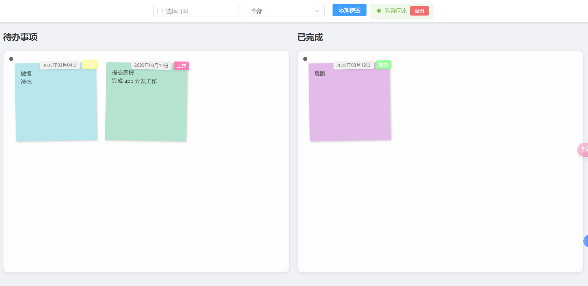
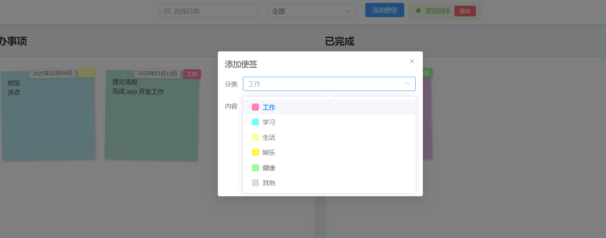

# sticky-notes（前端）
## 项目介绍
:heartpulse: 这是一个使用 vue3 和 element-plus 开发的多人协作便签应用，后端采用 springboot 和 jpa 实现。当前已实现登录注册功能，登录后可以创建、编辑、删除便签，并可以查看便签的详细信息。当前只是一个简单版本，后续会不断完善。



## 待实现功能
1. 便利贴支持 markdown 语法
2. 实现记忆照片墙
3. 实现便利贴的置顶
4. 实现便利贴的搜索
## 安装运行
```
npm install
```

```
npm run serve
```

